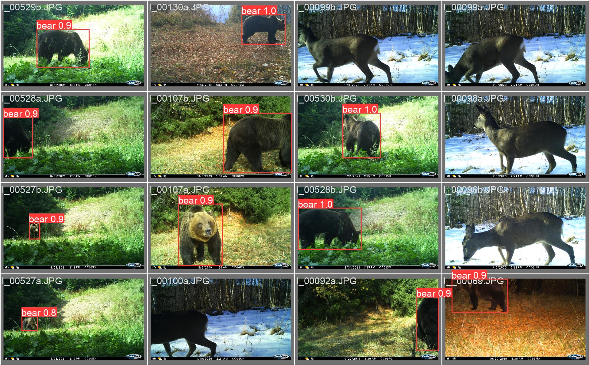
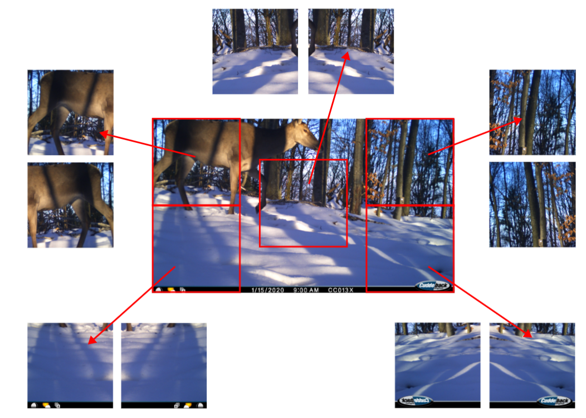
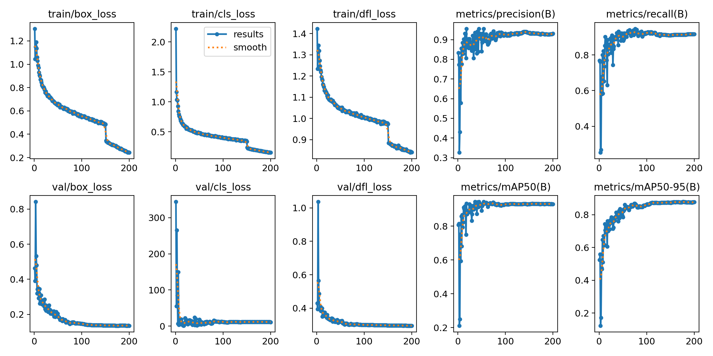

# beardetection

In this section, we describe how to train the beardetection object detector.



## Data

### Download the HackThePlanet Dataset

Run the following command:

```sh
make download_dataset
```

### Localize bears - bounding boxes

[GroundingDINO](https://github.com/IDEA-Research/GroundingDINO) is used to
annotate bears from images. It can also be done with
[MegaDetector](https://github.com/agentmorris/MegaDetector) in a similar way.

Run the following command to annotate the dataset with GroundingDINO:

```sh
make beardetection_data_annotate
```

### Data Split

To avoid data leakage, the split is done by camera ID + date:

```sh
make beardetection_data_split
```

### Data preparation

Run the following command to transform the annotations provided by
GroundingDINO into a YOLOv8 compatible format:

```sh
make beardetection_data_yolov8_bbox
```

Then make it ready for a YOLOv8 model to be trained on by moving the files into the right folder structure using the following command:

```sh
make beardetection_data_build_model_input_upsample
```

__Note:__ Upsampling is done to rebalance the two classes (bear, not bear).

We used random sampling from the generated tencrop data augmentation provided
by PyTorch.



## Training

The model can be trained for different imgsz which then leads to faster
inference. This tradeoff should be done for the end application in mind. If
this should be run on edge, then use a small imgsz at the cost of slightly
degraded performance. If running on a server or laptop, use a higher imgsz.

```sh
make beardetection_train_best_balance_upsample_imgsz_640 
make beardetection_train_best_balance_upsample_imgsz_320
make beardetection_train_best_balance_upsample_imgsz_160
```

## Evaluation

Below is the performance of the 640 imgsz model.

| Normalized Confusion Matrix | Training Metrics | Precision Recall |
|:---------------------------:|:----------------:|:----------------:|
|  |  | 


Run the following command to evaluate the performance of all the trained models.

```sh
make beardetection_eval_all
```

## Inference

Run the following command to try the inference.

```sh
make beardetection_predict
```

Adapt the following script to run on your own images:

```sh
python ./scripts/beardetection/model/predict.py \
  --model-weights ./data/06_models/beardetection/model/weights/model.pt \
  --source-path ./data/09_external/detect/images/bears/image1.jpg \
  --save-path ./data/07_model_output/beardetection/predictions/ \
  --loglevel "info"
```
